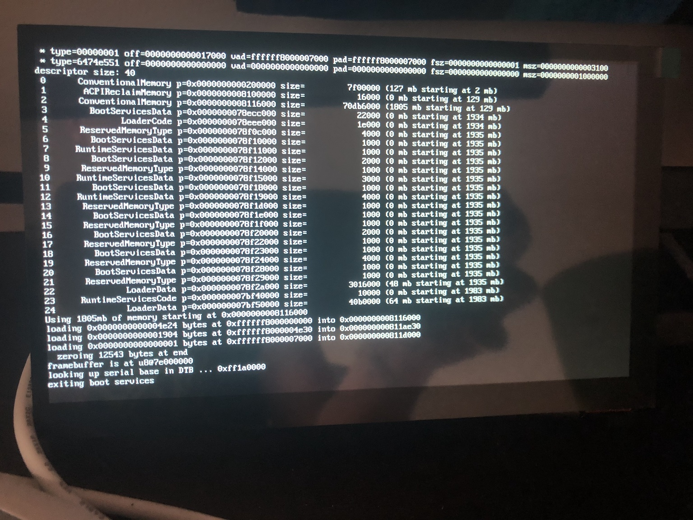
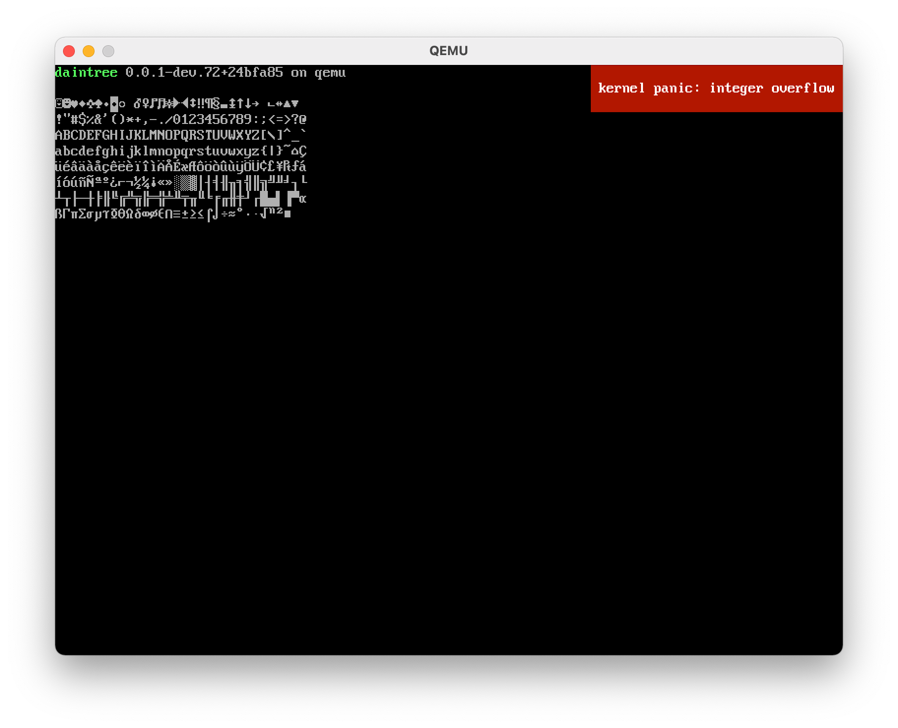

# daintree 

An ARMv8-A operating system, plus a UEFI bootloader, all written in Zig. Currently targetting and testing on:

* QEMU (using HVF acceleration on macOS), with EDK2
* ROCKPro64, with U-Boot ([patch required](https://patchwork.ozlabs.org/project/uboot/patch/20210209062150.mmshhxissljf6fak@talia.n4wrvuuuhszuhem3na2pm5saea.px.internal.cloudapp.net/))

There's a little [dev blog](https://github.com/kivikakk/daintree/discussions/1) I hope to maintain as I go.

## dainboot

A gentle introduction to Zig's UEFI support. Boots like this:

* Checks loaded image options.
  * You can pass `ramdisk 0x12345678 0x1234` to give it the location of the kernel already loaded in RAM. Useful for TFTP boot, which itself is handy for faster development cycles on bare metal.
* Scans filesystems the UEFI system knows about, looking for a file called `dainkrnl` in the root of any of them.
* Loads the kernel into memory somewhere vaguely reasonable.
* Exits UEFI boot services.
* Jumps to the kernel, passing the memory map and framebuffer prepared by UEFI.

| qemu | rockpro64 |
| :-: | :-: |
|  |  |

## dainkrnl

Right now, this just sets up the MMU and implements a small console.

MMU setup works on QEMU, but we don't get this far on bare metal yet. Need to actually reference the memory map.

| qemu | rockpro64 |
| :-: | :-: |
|  | wip |

## license

MIT, per [Zig](https://github.com/ziglang/zig).
